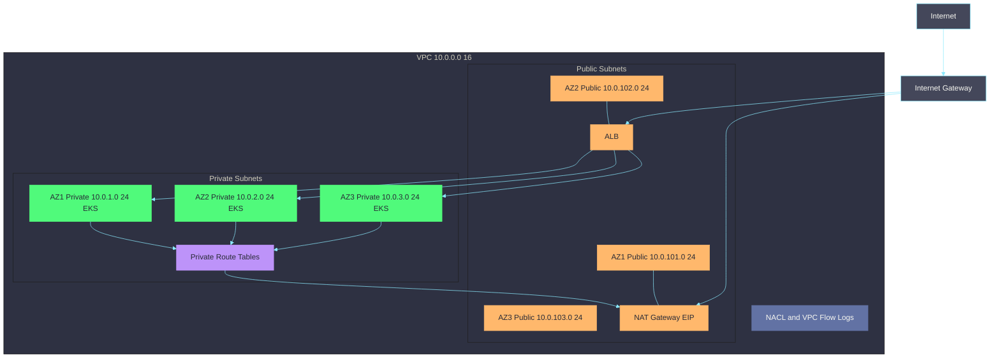
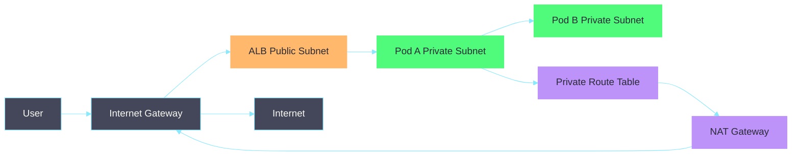
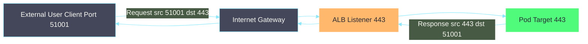
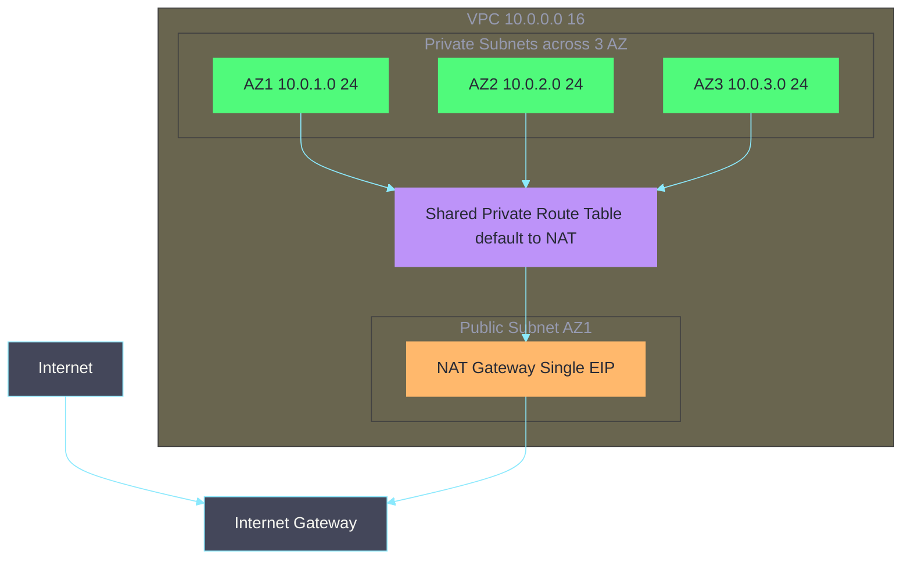
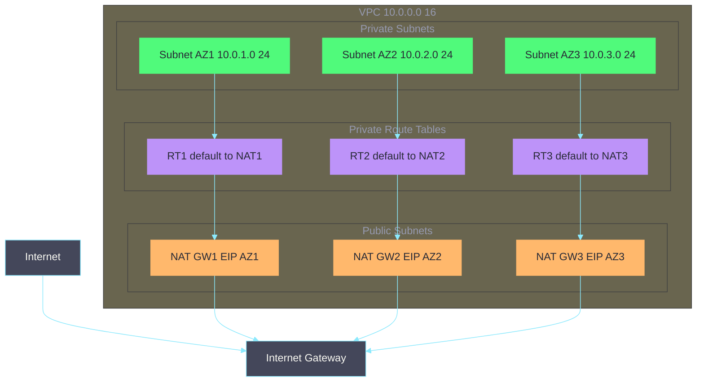
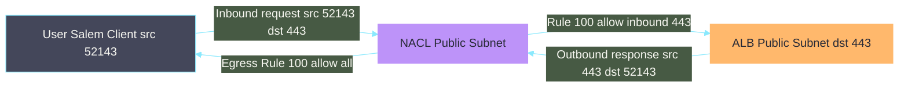
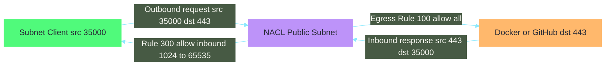
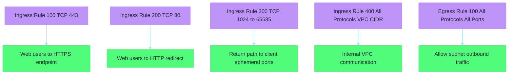
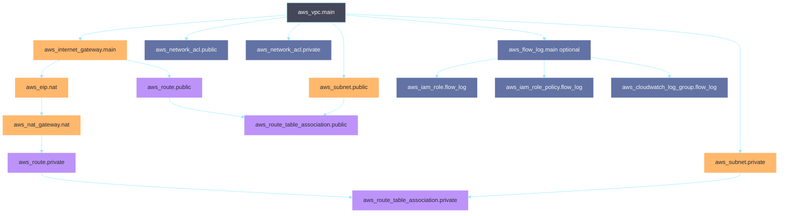

# VPC Module — Full Code Explanation

## What It Creates

A **VPC (Virtual Private Cloud)** is your own private network inside AWS.
This module builds a production-ready VPC with everything EKS needs to run.

---

## Network Architecture



---

## Traffic Flow Summary



### Port-Level Flow (Ephemeral vs 443)

```mermaid
%%{init: {'theme':'base','themeVariables':{'background':'#282A36','primaryColor':'#44475A','primaryTextColor':'#F8F8F2','primaryBorderColor':'#6272A4','lineColor':'#8BE9FD'}}}%%
flowchart LR
  pod[Pod Client Port 53021]
  rt[Private Route Table]
  nat[NAT Gateway EIP]
  dst[Docker or External API 443]

  pod -->|Request src 53021 dst 443| rt
  rt --> nat
  nat --> dst

  dst -->|Response src 443 dst 53021| nat
  nat --> rt
  rt --> pod

  classDef pri fill:#50FA7B,stroke:#50FA7B,color:#282A36;
  classDef route fill:#BD93F9,stroke:#BD93F9,color:#282A36;
  classDef pub fill:#FFB86C,stroke:#FFB86C,color:#282A36;

  class pod pri;
  class rt route;
  class nat,dst pub;
```





---

## Full Code Breakdown

---

### 1. Terraform & Provider Setup

```hcl
terraform {
  required_version = ">= 1.14.0"
  required_providers {
    aws = {
      source  = "hashicorp/aws"
      version = "~> 6.0"
    }
  }
}
```

**What it does:**
- `required_version` — Enforces a minimum Terraform CLI version. Prevents older versions from running code that uses newer syntax.
- `required_providers` — Declares that this module uses the official AWS provider from HashiCorp's registry.
- `version = "~> 6.0"` — Allows any 6.x version (e.g. 6.1, 6.2) but NOT 7.x. The `~>` operator is called a "pessimistic constraint" — it allows patch/minor upgrades but locks the major version.

---

### 2. VPC Resource

```hcl
resource "aws_vpc" "main" {
  cidr_block           = var.vpc_cidr
  enable_dns_hostnames = true
  enable_dns_support   = true
  tags = merge(
    var.tags,
    { Name = "${var.name_prefix}-vpc" }
  )
}
```

**What it does:**
- Creates the top-level isolated network in AWS. Every other resource (subnets, gateways, etc.) lives inside this VPC.
- `cidr_block` — The IP address range for the entire VPC. Example: `10.0.0.0/16` gives you 65,536 IP addresses to distribute across subnets.
- `enable_dns_hostnames = true` — Each EC2 instance/node inside the VPC gets a DNS name like `ip-10-0-1-5.ec2.internal`. EKS requires this so pods can resolve each other and the API server by name.
- `enable_dns_support = true` — Enables the AWS DNS resolver (at `.2` address in your VPC, e.g. `10.0.0.2`). Without this, DNS queries from inside the VPC fail entirely.
- `merge(var.tags, {...})` — Merges global tags (project, environment, owner) with a resource-specific `Name` tag. This avoids duplicating tag blocks everywhere.

> **Why DNS matters for EKS:** Kubernetes CoreDNS resolves service names like `my-service.default.svc.cluster.local`. If VPC DNS is off, CoreDNS itself can't start because it can't resolve the EKS API server endpoint.

---

### 3. Internet Gateway

```hcl
resource "aws_internet_gateway" "main" {
  vpc_id = aws_vpc.main.id
  tags   = merge(var.tags, { Name = "${var.name_prefix}-igw" })
}
```

**What it does:**
- Attaches a gateway to the VPC that allows two-way internet communication.
- There is always exactly **1 IGW per VPC**. AWS manages it as horizontally-scaled and highly available across all AZs — it never fails.
- Without this, nothing inside the VPC can reach or be reached from the internet, even if a resource has a public IP.
- Public subnets use this via a route table rule (`0.0.0.0/0 → IGW`).
- Private subnets do NOT use this — they use NAT Gateway for outbound-only internet access.

```
Public Subnet Instance  →  IGW  →  Internet   (both directions)
Private Subnet Instance →  NAT  →  IGW  →  Internet   (outbound only)
```

---

### 4. Public Subnets

```hcl
resource "aws_subnet" "public" {
  count                   = length(var.public_subnet_cidrs)
  vpc_id                  = aws_vpc.main.id
  cidr_block              = var.public_subnet_cidrs[count.index]
  availability_zone       = var.azs[count.index]
  map_public_ip_on_launch = true
  tags                    = merge(var.tags, var.public_subnet_tags, {
    Name = "${var.name_prefix}-public-subnet-${count.index}"
  })
}
```

**What it does:**
- Creates one public subnet per Availability Zone (AZ). If you pass 3 CIDRs, 3 subnets are created.
- `count = length(var.public_subnet_cidrs)` — Terraform's loop. If list has 3 items → creates 3 subnets. `count.index` is `0`, `1`, `2` for each iteration.
- `cidr_block = var.public_subnet_cidrs[count.index]` — Each subnet gets its own IP range. Example: `10.0.101.0/24` for AZ-1, `10.0.102.0/24` for AZ-2.
- `availability_zone = var.azs[count.index]` — Pins each subnet to a specific AZ. Example: `us-east-1a`, `us-east-1b`, `us-east-1c`.
- `map_public_ip_on_launch = true` — Any instance launched here automatically receives a public IP. Required for ALBs and NAT Gateways which need to be internet-reachable.
- `var.public_subnet_tags` — Passes EKS-specific tags (`kubernetes.io/role/elb=1`) so the Load Balancer Controller knows to place public ALBs here.

> **Why 3 AZs?** ALB requires at least 2 AZs. 3 AZs means your app survives an entire AZ outage — EKS will reschedule pods to healthy AZs automatically.

---

### 5. Private Subnets

```hcl
resource "aws_subnet" "private" {
  count             = length(var.private_subnet_cidrs)
  vpc_id            = aws_vpc.main.id
  cidr_block        = var.private_subnet_cidrs[count.index]
  availability_zone = var.azs[count.index]
  tags              = merge(var.tags, var.private_subnet_tags, {
    Name = "${var.name_prefix}-private-subnet-${count.index}"
  })
}
```

**What it does:**
- Same structure as public subnets, but with key differences:
- `map_public_ip_on_launch` is **absent** (defaults to `false`) — instances here never get public IPs.
- EKS worker nodes live here. They are unreachable from the internet but can make outbound calls via NAT Gateway.
- `var.private_subnet_tags` — Passes EKS tags (`kubernetes.io/role/internal-elb=1`) for internal load balancers.

```
Public Subnet:   Has public IP + route to IGW  → internet-reachable
Private Subnet:  No public IP + route to NAT   → outbound-only, not reachable inbound
```

---

### 6. Elastic IP for NAT Gateway

```hcl
resource "aws_eip" "nat" {
  count  = var.enable_nat_gateway ? (var.single_nat_gateway ? 1 : length(var.private_subnet_cidrs)) : 0
  domain = "vpc"
  tags   = merge(var.tags, { Name = "${var.name_prefix}-nat-eip-${count.index}" })

  depends_on = [aws_internet_gateway.main]
}
```

**What it does:**
- Allocates a static public IPv4 address (Elastic IP) for each NAT Gateway.
- NAT Gateway needs a static IP so external services (package registries, APIs) can allowlist it in their firewalls. If it changed every time, those allowlists would break.
- `domain = "vpc"` — Allocates the EIP for use inside a VPC (the modern standard; the old EC2-Classic mode is deprecated).
- `depends_on = [aws_internet_gateway.main]` — EIP allocation for NAT requires the IGW to exist first. Terraform's dependency graph doesn't always infer this automatically, so we declare it explicitly.

**Count logic explained:**

```
enable_nat_gateway = false  →  count = 0  (no EIPs at all)
enable_nat_gateway = true:
  single_nat_gateway = true   →  count = 1  (one EIP for one NAT)
  single_nat_gateway = false  →  count = 3  (one EIP per AZ, e.g. 3 AZs)
```

---

### 7. NAT Gateway

```hcl
resource "aws_nat_gateway" "nat" {
  count         = var.enable_nat_gateway ? (var.single_nat_gateway ? 1 : length(var.private_subnet_cidrs)) : 0
  subnet_id     = aws_subnet.public[count.index].id
  allocation_id = aws_eip.nat[count.index].id
  tags          = merge(var.tags, { Name = "${var.name_prefix}-nat-gateway-${count.index}" })

  depends_on = [aws_eip.nat]
}
```

**What it does:**
- Creates managed NAT Gateway(s) that allow private subnet instances to reach the internet outbound-only.
- `subnet_id = aws_subnet.public[count.index].id` — NAT Gateway is always placed in a **public** subnet because it needs access to the IGW to forward traffic to the internet.
- `allocation_id = aws_eip.nat[count.index].id` — Associates the static EIP we created. This becomes the NAT Gateway's public IP address.

**How NAT works step-by-step:**
```
1. EKS node (10.0.1.5) sends request to hub.docker.com
2. Packet goes to private route table → directed to NAT GW
3. NAT GW replaces source IP 10.0.1.5 with its EIP (e.g. 54.23.1.100)
4. Docker Hub responds to 54.23.1.100
5. NAT GW forwards response back to 10.0.1.5
```

**Single vs Multi-AZ:**

```
single_nat_gateway = true  (dev/staging):
  All private subnets → 1 NAT in AZ-1
  ⚠️  If AZ-1 fails → ALL nodes lose internet access

single_nat_gateway = false  (production):
  AZ-1 private subnet → NAT-1 in AZ-1 public subnet
  AZ-2 private subnet → NAT-2 in AZ-2 public subnet
  AZ-3 private subnet → NAT-3 in AZ-3 public subnet
  ✅  If AZ-1 fails → AZ-2 and AZ-3 continue unaffected
```

**Diagram: Single NAT Gateway (`single_nat_gateway = true`)**



**Diagram: Multi NAT Gateway (`single_nat_gateway = false`)**



---

### 8. Public Route Table

```hcl
resource "aws_route_table" "public" {
  vpc_id = aws_vpc.main.id
  tags   = merge(var.tags, { Name = "${var.name_prefix}-public-route-table" })
}
```

**What it does:**
- Creates a single route table for all public subnets.
- A route table is a set of rules that tell network packets where to go based on their destination IP.
- Only 1 public route table is needed because all public subnets share the same IGW (which is VPC-wide and always available).

---

### 9. Public Route (IGW)

```hcl
resource "aws_route" "public" {
  route_table_id         = aws_route_table.public.id
  destination_cidr_block = "0.0.0.0/0"
  gateway_id             = aws_internet_gateway.main.id

  depends_on = [aws_internet_gateway.main]
}
```

**What it does:**
- Adds the actual routing rule: "Send all traffic (`0.0.0.0/0`) to the Internet Gateway."
- `0.0.0.0/0` is the **default route** — it matches any IP address not covered by a more specific rule. Think of it as "everything else goes here."
- This single rule is what makes a subnet "public". Without it, even if the IGW exists and the subnet has public IPs, no traffic flows through.

**Why 0.0.0.0/0 → IGW allows BOTH ingress and egress:**
```
Outbound: Instance requests google.com → route table sends it to IGW → internet
Inbound:  Someone connects to your instance's public IP → IGW translates to private IP → instance receives it
```
The IGW is stateful and bidirectional — it handles both directions automatically.

---

### 10. Public Route Table Association

```hcl
resource "aws_route_table_association" "public" {
  count          = length(var.public_subnet_cidrs)
  subnet_id      = aws_subnet.public[count.index].id
  route_table_id = aws_route_table.public.id

  depends_on = [aws_route.public]
}
```

**What it does:**
- Links each public subnet to the public route table. Without this, subnets fall back to the VPC's default (main) route table — which has no internet route — making them accidentally private.
- One association per subnet, all pointing to the same route table.

---

### 11. Private Route Tables

```hcl
resource "aws_route_table" "private" {
  count  = var.enable_nat_gateway ? (var.single_nat_gateway ? 1 : length(var.private_subnet_cidrs)) : 1
  vpc_id = aws_vpc.main.id
  tags   = merge(var.tags, { Name = "${var.name_prefix}-private-route-table-${count.index}" })
}
```

**What it does:**
- Creates one or more private route tables depending on the NAT Gateway setup.

**Count logic:**

```
enable_nat_gateway = false  →  1 route table (no internet route, just local VPC)
enable_nat_gateway = true:
  single_nat_gateway = true   →  1 route table (all subnets share NAT in AZ-1)
  single_nat_gateway = false  →  3 route tables (one per AZ, each pointing to its own NAT)
```

**Why multiple private route tables (but only 1 public)?**
```
IGW is VPC-wide  →  1 public RT is enough (IGW never fails per-AZ)

NAT GW is AZ-specific  →  if NAT in AZ-1 fails and AZ-2 subnet points to it, AZ-2 loses internet
                      →  each AZ needs its own route table pointing to its own NAT GW
```

---

### 12. Private Route (NAT Gateway)

```hcl
resource "aws_route" "private" {
  count                  = var.enable_nat_gateway ? (var.single_nat_gateway ? 1 : length(var.private_subnet_cidrs)) : 0
  route_table_id         = aws_route_table.private[count.index].id
  destination_cidr_block = "0.0.0.0/0"
  nat_gateway_id         = aws_nat_gateway.nat[count.index].id

  depends_on = [aws_nat_gateway.nat]
}
```

**What it does:**
- Adds the routing rule to each private route table: "Send all outbound traffic to the NAT Gateway."
- Same `0.0.0.0/0` destination as the public route, but pointing to NAT instead of IGW.
- The NAT Gateway only forwards outbound traffic and blocks unsolicited inbound — unlike IGW which is bidirectional.

```
Private RT-1:  0.0.0.0/0  →  NAT-GW-1  (AZ-1 nodes use this)
Private RT-2:  0.0.0.0/0  →  NAT-GW-2  (AZ-2 nodes use this)
Private RT-3:  0.0.0.0/0  →  NAT-GW-3  (AZ-3 nodes use this)
```

---

### 13. Private Route Table Association

```hcl
resource "aws_route_table_association" "private" {
  count          = length(var.private_subnet_cidrs)
  subnet_id      = aws_subnet.private[count.index].id
  route_table_id = aws_route_table.private[
    var.enable_nat_gateway ? (var.single_nat_gateway ? 0 : count.index) : 0
  ].id

  depends_on = [aws_route.private]
}
```

**What it does:**
- Associates each private subnet with the correct route table.
- The index logic inside `aws_route_table.private[...]` is the key part:

```
single_nat_gateway = true:
  All subnets → route_table.private[0]  (the single shared table)

single_nat_gateway = false:
  Subnet-0 (AZ-1) → route_table.private[0]  (points to NAT-1)
  Subnet-1 (AZ-2) → route_table.private[1]  (points to NAT-2)
  Subnet-2 (AZ-3) → route_table.private[2]  (points to NAT-3)

enable_nat_gateway = false:
  All subnets → route_table.private[0]  (local VPC only, no internet)
```

---

### 14. Network ACLs — Public Subnets

```hcl
resource "aws_network_acl" "public" {
  vpc_id     = aws_vpc.main.id
  subnet_ids = aws_subnet.public[*].id

  ingress { rule_no = 100  protocol = "tcp"  action = "allow"  cidr_block = "0.0.0.0/0"  from_port = 443   to_port = 443   }
  ingress { rule_no = 200  protocol = "tcp"  action = "allow"  cidr_block = "0.0.0.0/0"  from_port = 80    to_port = 80    }
  ingress { rule_no = 300  protocol = "tcp"  action = "allow"  cidr_block = "0.0.0.0/0"  from_port = 1024  to_port = 65535 }
  ingress { rule_no = 400  protocol = "-1"   action = "allow"  cidr_block = var.vpc_cidr  from_port = 0     to_port = 0     }

  egress  { rule_no = 100  protocol = "-1"   action = "allow"  cidr_block = "0.0.0.0/0"  from_port = 0     to_port = 0     }
}
```

**What it does:**
- NACLs are **stateless** subnet-level firewalls. They evaluate rules in ascending `rule_no` order — first match wins.
- `aws_subnet.public[*].id` — The `[*]` splat expression expands to all public subnet IDs: `[id1, id2, id3]`.

**NACL vs Security Group:**

```
Security Group:  Stateful   — allow inbound 443 → response automatically allowed outbound
NACL:            Stateless  — allow inbound 443 → must ALSO explicitly allow response (ephemeral ports)
```

**Inbound Rules:**

| Rule | From | Source Port | Destination Port | Why |
|------|------|-------------|------------------|-----|
| 100 | Anywhere | 1024-65535 | 443 | HTTPS traffic to ALB |
| 200 | Anywhere | 1024-65535 | 80 | HTTP traffic (for redirect to HTTPS) |
| 300 | Anywhere | 80 or 443 | 1024-65535 | Return traffic from outbound requests (stateless — must be explicit) |
| 400 | VPC CIDR | Any | Any | Internal VPC communication (NAT GW -> subnets, etc.) |

**Ephemeral ports explained:**
```
Your ALB makes a connection to Docker Hub on port 443.
Docker Hub responds back to your ALB on a HIGH port (e.g. 54231) — called ephemeral.
Because NACLs are stateless, you must allow inbound 1024-65535 or the response is blocked.
```

**Round Trip NACL Diagrams (Stateless Behavior):**







**Outbound:**
- Rule 100: Allow everything outbound. Public subnets need unrestricted outbound for ALB → node communication and NAT forwarding.

---

### 15. Network ACLs — Private Subnets

```hcl
resource "aws_network_acl" "private" {
  vpc_id     = aws_vpc.main.id
  subnet_ids = aws_subnet.private[*].id

  ingress { rule_no = 100  protocol = "-1"   action = "allow"  cidr_block = var.vpc_cidr  from_port = 0     to_port = 0     }
  ingress { rule_no = 200  protocol = "tcp"  action = "allow"  cidr_block = "0.0.0.0/0"  from_port = 1024  to_port = 65535 }

  egress  { rule_no = 100  protocol = "-1"   action = "allow"  cidr_block = "0.0.0.0/0"  from_port = 0     to_port = 0     }
}
```

**What it does:**
- More restrictive than the public NACL — private subnets should never receive direct internet traffic.

**Inbound Rules:**

| Rule | Port | From | Why |
|------|------|------|-----|
| 100 | All | VPC CIDR only | ALB → nodes, node → node, control plane → nodes |
| 200 | 1024-65535 | Anywhere | Return traffic from NAT GW outbound requests |

**Why allow ephemeral ports from 0.0.0.0/0 here?**
```
EKS node (private subnet) → NAT GW → Docker Hub
Docker Hub responds to NAT GW EIP → NAT GW forwards to node on an ephemeral port
The response arrives from Docker Hub's IP (internet), not from inside the VPC
So CIDR must be 0.0.0.0/0 to allow it, not just the VPC CIDR
```

**Outbound:**
- Rule 100: Allow all outbound. Nodes need to pull images, call APIs, send to NAT GW, etc.

---

### 16. VPC Flow Logs — IAM Role

```hcl
resource "aws_iam_role" "flow_log" {
  count       = var.enable_flow_logs ? 1 : 0
  name_prefix = "${var.name_prefix}-vpc-flow-log-"

  assume_role_policy = jsonencode({
    Version = "2012-10-17"
    Statement = [{
      Action    = "sts:AssumeRole"
      Effect    = "Allow"
      Principal = { Service = "vpc-flow-logs.amazonaws.com" }
    }]
  })
}
```

**What it does:**
- Creates an IAM role that the VPC Flow Logs service can assume to write logs to CloudWatch.
- `count = var.enable_flow_logs ? 1 : 0` — Conditional resource creation. Set `enable_flow_logs = true` in `terraform.tfvars` to create it.
- `assume_role_policy` — The trust policy: defines **who** can assume this role. Here, only the AWS service `vpc-flow-logs.amazonaws.com` is allowed — not a user, not another service.
- `sts:AssumeRole` — The action that lets the service temporarily take on this role's permissions.

---

### 17. VPC Flow Logs — IAM Policy

```hcl
resource "aws_iam_role_policy" "flow_log" {
  count       = var.enable_flow_logs ? 1 : 0
  name_prefix = "${var.name_prefix}-vpc-flow-log-"
  role        = aws_iam_role.flow_log[0].id

  policy = jsonencode({
    Version = "2012-10-17"
    Statement = [{
      Action = [
        "logs:CreateLogGroup",
        "logs:CreateLogStream",
        "logs:PutLogEvents",
        "logs:DescribeLogGroups",
        "logs:DescribeLogStreams"
      ]
      Effect   = "Allow"
      Resource = "*"
    }]
  })
}
```

**What it does:**
- Grants the flow log role **what it's allowed to do** once it assumes the role.
- These 5 CloudWatch Logs actions are the minimum required:
  - `CreateLogGroup` / `CreateLogStream` — Create the storage containers for logs
  - `PutLogEvents` — Actually write log records
  - `DescribeLogGroups` / `DescribeLogStreams` — Read metadata (used to check if group/stream already exists before creating)

---

### 18. VPC Flow Logs — CloudWatch Log Group

```hcl
resource "aws_cloudwatch_log_group" "flow_log" {
  count             = var.enable_flow_logs ? 1 : 0
  name              = "/aws/vpc/${var.name_prefix}/flow-logs"
  retention_in_days = var.flow_logs_retention_in_days
}
```

**What it does:**
- Creates the CloudWatch Logs destination where flow log records are stored.
- `name = "/aws/vpc/..."` — AWS convention for naming log groups by service. Makes it easy to find in the console.
- `retention_in_days` — Automatically deletes logs older than this value. Default is typically 30 days — balances compliance needs with CloudWatch storage costs (~$0.50/GB/month).

---

### 19. VPC Flow Log Resource

```hcl
resource "aws_flow_log" "main" {
  count           = var.enable_flow_logs ? 1 : 0
  vpc_id          = aws_vpc.main.id
  traffic_type    = "ALL"
  iam_role_arn    = aws_iam_role.flow_log[0].arn
  log_destination = aws_cloudwatch_log_group.flow_log[0].arn
}
```

**What it does:**
- The actual resource that enables flow logging on the VPC. Ties everything together.
- `vpc_id` — Monitor this specific VPC.
- `traffic_type = "ALL"` — Captures both ACCEPT and REJECT traffic. Options:
  - `"ACCEPT"` — Only allowed traffic (lower volume, lower cost)
  - `"REJECT"` — Only blocked traffic (good for detecting attacks)
  - `"ALL"` — Everything (recommended for security auditing)
- `iam_role_arn` — The role the flow log service uses to write to CloudWatch.
- `log_destination` — The CloudWatch log group ARN where data is sent.

**What each log record looks like:**
```
version  account-id  interface-id  srcaddr     dstaddr      srcport  dstport  protocol  packets  bytes  action
2        123456789   eni-abc123    10.0.1.5    172.217.0.1  54231    443      6         10       5000   ACCEPT
```

---

## Complete Resource Dependency Chain



---

## Variable Reference

| Variable | Purpose | Example |
|---|---|---|
| `vpc_cidr` | IP range for the entire VPC | `"10.0.0.0/16"` |
| `azs` | List of AZs to deploy into | `["us-east-1a", "us-east-1b", "us-east-1c"]` |
| `public_subnet_cidrs` | IP ranges for public subnets | `["10.0.101.0/24", "10.0.102.0/24"]` |
| `private_subnet_cidrs` | IP ranges for private subnets | `["10.0.1.0/24", "10.0.2.0/24"]` |
| `enable_nat_gateway` | Whether to create NAT Gateway | `true` |
| `single_nat_gateway` | Use 1 NAT (cheap) or 1 per AZ (HA) | `false` for prod |
| `enable_flow_logs` | Enable VPC traffic logging | `true` for prod |
| `flow_logs_retention_in_days` | How long to keep logs | `30` |
| `public_subnet_tags` | EKS tags for ALB discovery | `kubernetes.io/role/elb=1` |
| `private_subnet_tags` | EKS tags for internal ALB discovery | `kubernetes.io/role/internal-elb=1` |
