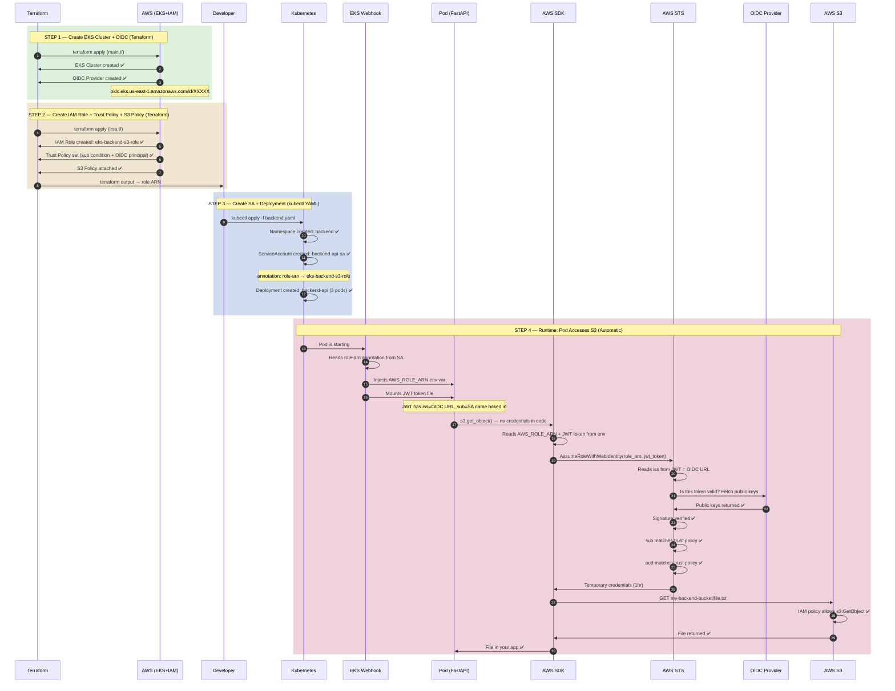

# EKS + OIDC + IRSA — Complete Flow Guide

## The 4 Steps Overview

```
Step 1: Terraform → EKS Cluster + OIDC Provider
Step 2: Terraform → IAM Role + Trust Policy + S3 Policy
Step 3: kubectl  → Namespace + ServiceAccount + Deployment
Step 4: Runtime  → JWT minted → STS verified → S3 accessed
```

---

## Step 1: Create EKS Cluster + OIDC Provider (Terraform)

### What gets created
```
AWS Account
  └── EKS Cluster (my-eks-cluster)
        └── OIDC Provider
              └── https://oidc.eks.us-east-1.amazonaws.com/id/XXXXX
                   │
                   │  This URL is the identity verifier
                   │  ONE per cluster, shared by ALL service accounts
                   │  Never changes until cluster is deleted
                   └── Stored in AWS as trusted identity provider
```

### Terraform Code

```hcl
# main.tf

terraform {
  required_providers {
    aws        = { source = "hashicorp/aws",       version = "~> 5.0" }
    kubernetes = { source = "hashicorp/kubernetes", version = "~> 2.0" }
  }
}

provider "aws" {
  region = "us-east-1"
}

# ── VPC ──────────────────────────────────────────────────────
module "vpc" {
  source  = "terraform-aws-modules/vpc/aws"
  version = "~> 5.0"

  name            = "my-eks-vpc"
  cidr            = "10.0.0.0/16"
  azs             = ["us-east-1a", "us-east-1b"]
  private_subnets = ["10.0.1.0/24", "10.0.2.0/24"]
  public_subnets  = ["10.0.101.0/24", "10.0.102.0/24"]
  enable_nat_gateway = true
}

# ── EKS Cluster ───────────────────────────────────────────────
module "eks" {
  source          = "terraform-aws-modules/eks/aws"
  version         = "~> 20.0"

  cluster_name    = "my-eks-cluster"
  cluster_version = "1.29"
  vpc_id          = module.vpc.vpc_id
  subnet_ids      = module.vpc.private_subnets

  # ✅ THIS ONE LINE creates the OIDC provider for the whole cluster
  # All service accounts share this single OIDC provider
  enable_irsa = true

  eks_managed_node_groups = {
    default = {
      instance_types = ["t3.medium"]
      min_size       = 1
      max_size       = 3
      desired_size   = 2
    }
  }
}

# ── Kubernetes Provider ───────────────────────────────────────
provider "kubernetes" {
  host                   = module.eks.cluster_endpoint
  cluster_ca_certificate = base64decode(module.eks.cluster_certificate_authority_data)
  exec {
    api_version = "client.authentication.k8s.io/v1beta1"
    command     = "aws"
    args        = ["eks", "get-token", "--cluster-name", module.eks.cluster_name]
  }
}
```

### What AWS creates after `terraform apply`
```
✅ EKS Cluster: my-eks-cluster
✅ OIDC Provider: arn:aws:iam::123456789:oidc-provider/oidc.eks.us-east-1.amazonaws.com/id/XXXXX
✅ OIDC URL: https://oidc.eks.us-east-1.amazonaws.com/id/XXXXX
✅ VPC + Subnets + Node Groups
```

---

## Step 2: Create IAM Role + Trust Policy + S3 Policy (Terraform)

### What gets created
```
AWS IAM
  └── Role: eks-backend-s3-role
        ├── Trust Policy
        │     └── Who can assume: OIDC Provider
        │           └── Condition: sub = system:serviceaccount:backend:backend-api-sa
        │                          aud = sts.amazonaws.com
        └── Policy: AmazonS3ReadOnlyAccess + custom bucket access
```

### Terraform Code — Reusable Module

```hcl
# modules/irsa/variables.tf

variable "oidc_provider_arn"    { description = "OIDC provider ARN from EKS" }
variable "oidc_issuer_url"      { description = "OIDC issuer URL from EKS" }
variable "namespace"            { description = "K8s namespace of the ServiceAccount" }
variable "service_account_name" { description = "K8s ServiceAccount name" }
variable "role_name"            { description = "IAM Role name — can be anything" }
variable "role_description"     { default = "" }
variable "policy_arns"          { type = list(string); default = [] }
variable "inline_policy"        { default = null }
variable "inline_policy_name"   { default = "custom-policy" }
variable "tags"                 { type = map(string); default = {} }
```

```hcl
# modules/irsa/main.tf

locals {
  # Strip https:// — needed for condition key format
  oidc_id = replace(var.oidc_issuer_url, "https://", "")
}

# ── IAM Role ──────────────────────────────────────────────────
resource "aws_iam_role" "this" {
  name        = var.role_name
  description = var.role_description
  tags        = var.tags

  # Trust Policy — WHO can assume this role + UNDER WHAT conditions
  assume_role_policy = jsonencode({
    Version = "2012-10-17"
    Statement = [{
      Effect = "Allow"

      # Principal = WHO is accessing
      # Federated = external identity provider (not AWS service)
      Principal = {
        Federated = var.oidc_provider_arn
      }

      # Different from normal roles:
      # Normal EC2/Lambda → sts:AssumeRole
      # OIDC/IRSA         → sts:AssumeRoleWithWebIdentity
      Action = "sts:AssumeRoleWithWebIdentity"

      # Conditions — locks role to ONE specific ServiceAccount
      # Without this, any pod in cluster could assume this role
      Condition = {
        StringEquals = {
          # sub = which ServiceAccount is allowed
          # format: system:serviceaccount:<namespace>:<sa-name>
          "${local.oidc_id}:sub" = "system:serviceaccount:${var.namespace}:${var.service_account_name}"

          # aud = who the token is for — always sts.amazonaws.com for IRSA
          "${local.oidc_id}:aud" = "sts.amazonaws.com"
        }
      }
    }]
  })
}

# ── Attach AWS Managed Policies ───────────────────────────────
resource "aws_iam_role_policy_attachment" "managed" {
  for_each   = toset(var.policy_arns)
  role       = aws_iam_role.this.name
  policy_arn = each.value
}

# ── Attach Custom Inline Policy ───────────────────────────────
resource "aws_iam_role_policy" "inline" {
  count  = var.inline_policy != null ? 1 : 0
  name   = var.inline_policy_name
  role   = aws_iam_role.this.id
  policy = var.inline_policy
}
```

### Deep Dive — `aws_iam_role` Trust Policy Explained

The `aws_iam_role` resource above is the **most critical piece** of IRSA. Here's every field explained:

---

#### `name`, `description`, `tags`

```hcl
name        = var.role_name        # e.g. "eks-backend-s3-role"
description = var.role_description # human-readable purpose
tags        = var.tags             # key-value labels for organization/billing
```

Simple metadata — just naming and tagging the IAM role.

---

#### `assume_role_policy` — The Trust Policy

```hcl
assume_role_policy = jsonencode({ ... })
```

This is the **trust policy** — it answers: **"WHO is allowed to assume (use) this role?"**

Think of it like a **door lock** — it defines who has the key.

`jsonencode()` converts HCL map → JSON string, because AWS expects trust policies in JSON format.

---

#### `Version = "2012-10-17"`

This is the **IAM policy language version**. It's always `"2012-10-17"` — this is **not a date you choose**, it's the latest (and only widely used) version of the AWS policy language. Always use this.

---

#### `Effect = "Allow"`

Two possible values: `"Allow"` or `"Deny"`. Here it says: **"Yes, allow this action"**.

---

#### `Principal` — **WHO** Can Assume This Role

```hcl
Principal = {
  Federated = var.oidc_provider_arn
}
```

**Principal = the entity requesting access.**

| Principal Type | Example | Use Case |
|---|---|---|
| `Service` | `"ec2.amazonaws.com"` | AWS service (EC2, Lambda) assuming the role |
| `AWS` | `"arn:aws:iam::123456:root"` | Another AWS account or IAM user |
| **`Federated`** | `"arn:aws:iam::123456:oidc-provider/oidc.eks..."` | **External identity provider (OIDC)** |

**Why `Federated`?** In IRSA, the Kubernetes cluster acts as an **external identity provider** using OIDC. The pod gets a **JWT token** from Kubernetes, and AWS verifies that token against the OIDC provider. Since the identity comes from **outside AWS** (from Kubernetes), it's "federated."

`var.oidc_provider_arn` looks like:
```
arn:aws:iam::123456789012:oidc-provider/oidc.eks.us-east-1.amazonaws.com/id/ABCDEF1234567890
```

---

#### `Action = "sts:AssumeRoleWithWebIdentity"`

This specifies **what action** the principal can perform.

**Why not `sts:AssumeRole`?**

| Action | When Used | How It Works |
|---|---|---|
| `sts:AssumeRole` | AWS service or IAM user | Uses AWS credentials directly |
| **`sts:AssumeRoleWithWebIdentity`** | **OIDC/Federated identity** | **Uses a JWT token from an external identity provider** |

Since our pod gets a **JWT (web identity token)** from the Kubernetes OIDC provider, it uses `AssumeRoleWithWebIdentity`:

```
Pod → gets JWT from K8s → sends JWT to AWS STS → STS verifies with OIDC provider → returns temporary AWS credentials
```

---

#### `Condition` — **UNDER WHAT conditions** is access allowed

This is the **security lock-down**. Without conditions, **any pod in the cluster** could assume this role (because the OIDC provider covers the whole cluster).

```hcl
Condition = {
  StringEquals = { ... }
}
```

`StringEquals` = values must match **exactly** (case-sensitive). More secure than `StringLike` (which supports wildcards).

---

#### Condition 1: `:sub` (Subject) — **WHICH ServiceAccount**

```hcl
"${local.oidc_id}:sub" = "system:serviceaccount:${var.namespace}:${var.service_account_name}"
```

| Part | Meaning |
|---|---|
| `${local.oidc_id}` | OIDC provider ID, e.g. `oidc.eks.us-east-1.amazonaws.com/id/ABCDEF...` |
| `:sub` | The **subject** claim inside the JWT — identifies **who** the token was issued to |
| `system:serviceaccount:` | Kubernetes format for ServiceAccount identity |
| `${var.namespace}` | K8s namespace, e.g. `backend` |
| `${var.service_account_name}` | K8s ServiceAccount name, e.g. `backend-api-sa` |

**Full example value:** `"system:serviceaccount:backend:backend-api-sa"`

**What this does:** Only a pod running with **this exact ServiceAccount** in **this exact namespace** can assume the role. Different SA or different namespace → **ACCESS DENIED**.

---

#### Condition 2: `:aud` (Audience) — **WHO the token is for**

```hcl
"${local.oidc_id}:aud" = "sts.amazonaws.com"
```

| Part | Meaning |
|---|---|
| `:aud` | The **audience** claim inside the JWT — identifies **who the token is intended for** |
| `sts.amazonaws.com` | Token is intended for AWS STS (Security Token Service) |

**What this does:** Ensures the JWT was specifically created for **AWS STS**. Prevents a token created for another purpose from being reused. This is **always** `sts.amazonaws.com` for IRSA.

---

#### Complete Verification Flow

```
┌──────────────────────────────────────────────────────────────┐
│ Pod starts with ServiceAccount "backend-api-sa"              │
│ in namespace "backend"                                       │
│                                                              │
│ K8s injects a JWT into the pod containing:                   │
│   sub: "system:serviceaccount:backend:backend-api-sa"        │
│   aud: "sts.amazonaws.com"                                   │
└────────────────────────┬─────────────────────────────────────┘
                         │
                         ▼
┌──────────────────────────────────────────────────────────────┐
│ Pod calls AWS STS: AssumeRoleWithWebIdentity                 │
│   sends the JWT token + requests this IAM role               │
└────────────────────────┬─────────────────────────────────────┘
                         │
                         ▼
┌──────────────────────────────────────────────────────────────┐
│ AWS STS checks:                                              │
│   ✅ Is Principal (OIDC provider) valid?                     │
│   ✅ Is Action = AssumeRoleWithWebIdentity?                  │
│   ✅ Does JWT "sub" match the condition?                     │
│   ✅ Does JWT "aud" match "sts.amazonaws.com"?               │
│                                                              │
│   ALL pass → returns temporary AWS credentials               │
│   ANY fail → ACCESS DENIED                                   │
└──────────────────────────────────────────────────────────────┘
```

---

```hcl
# modules/irsa/outputs.tf

output "role_arn"  { value = aws_iam_role.this.arn }
output "role_name" { value = aws_iam_role.this.name }
```

```hcl
# irsa.tf — Call the module for each app

module "irsa_backend" {
  source = "./modules/irsa"

  # Same OIDC provider for all service accounts in this cluster
  oidc_provider_arn    = module.eks.oidc_provider_arn
  oidc_issuer_url      = module.eks.cluster_oidc_issuer_url

  # Must match K8s SA name + namespace exactly (used in sub condition)
  namespace            = "backend"
  service_account_name = "backend-api-sa"

  # IAM Role name — completely independent from SA name
  role_name            = "eks-backend-s3-role"
  role_description     = "Backend API S3 access"

  # AWS managed policy
  policy_arns = ["arn:aws:iam::aws:policy/AmazonS3ReadOnlyAccess"]

  # Fine-grained custom policy for specific bucket
  inline_policy_name = "backend-specific-bucket"
  inline_policy = jsonencode({
    Version = "2012-10-17"
    Statement = [{
      Effect   = "Allow"
      Action   = ["s3:GetObject", "s3:PutObject", "s3:DeleteObject"]
      Resource = "arn:aws:s3:::my-backend-bucket/*"
    },
    {
      Effect   = "Allow"
      Action   = ["s3:ListBucket"]
      Resource = "arn:aws:s3:::my-backend-bucket"
    }]
  })

  tags = { Team = "backend", Env = "production" }
}
```

```hcl
# outputs.tf — Share role ARN with app team

output "backend_role_arn" {
  description = "Give this to app team for K8s SA annotation"
  value       = module.irsa_backend.role_arn
}
```

### What AWS creates after `terraform apply`
```
✅ IAM Role: eks-backend-s3-role
      arn:aws:iam::123456789:role/eks-backend-s3-role

✅ Trust Policy inside the role:
      Principal: oidc-provider/oidc.eks...XXXXX (Federated)
      Action:    sts:AssumeRoleWithWebIdentity
      Condition: sub = system:serviceaccount:backend:backend-api-sa
                 aud = sts.amazonaws.com

✅ Policy attached:
      AmazonS3ReadOnlyAccess
      custom inline: s3:GetObject, s3:PutObject on my-backend-bucket
```

### Get Role ARN for next step
```bash
terraform output backend_role_arn
# arn:aws:iam::123456789:role/eks-backend-s3-role
# ← give this to app team
```

---

## Step 3: Create Namespace + ServiceAccount + Deployment (kubectl YAML)

### What gets created
```
Kubernetes Cluster
  └── Namespace: backend
        ├── ServiceAccount: backend-api-sa
        │     └── annotation: role-arn → eks-backend-s3-role  (link to AWS)
        └── Deployment: backend-api
              └── Pod (x3)
                    └── serviceAccountName: backend-api-sa
```

### YAML Code

```yaml
# backend.yaml

---
# ── Namespace ─────────────────────────────────────────────────
apiVersion: v1
kind: Namespace
metadata:
  name: backend

---
# ── ServiceAccount ────────────────────────────────────────────
apiVersion: v1
kind: ServiceAccount
metadata:
  name: backend-api-sa          # must match sub condition in trust policy exactly
  namespace: backend            # must match sub condition in trust policy exactly
  annotations:
    eks.amazonaws.com/role-arn: arn:aws:iam::123456789:role/eks-backend-s3-role
    # ☝️ this is the ONLY AWS reference in your entire YAML
    # no OIDC, no trust policy, no IAM policy mentioned here
    # just a pointer: "this SA should use this IAM Role"

---
# ── Deployment ────────────────────────────────────────────────
apiVersion: apps/v1
kind: Deployment
metadata:
  name: backend-api
  namespace: backend
spec:
  replicas: 3                   # all 3 pods share same SA → same AWS access
  selector:
    matchLabels:
      app: backend-api
  template:
    metadata:
      labels:
        app: backend-api
    spec:
      serviceAccountName: backend-api-sa   # ← links pod to the SA above
                                            # EKS does everything else automatically

      containers:
        - name: backend
          image: my-backend:latest
          ports:
            - containerPort: 8000
          env:
            - name: AWS_REGION
              value: "us-east-1"
            - name: BUCKET_NAME
              value: "my-backend-bucket"

          # ✅ DO NOT set these manually — EKS auto-injects them:
          # AWS_ROLE_ARN=arn:aws:iam::123456789:role/eks-backend-s3-role
          # AWS_WEB_IDENTITY_TOKEN_FILE=/var/run/secrets/eks.amazonaws.com/serviceaccount/token
```

### Apply the YAML
```bash
# Connect kubectl to EKS cluster
aws eks update-kubeconfig --name my-eks-cluster --region us-east-1

# Apply
kubectl apply -f backend.yaml

# Verify namespace created
kubectl get namespace backend

# Verify SA created with annotation
kubectl describe sa backend-api-sa -n backend
# Annotations: eks.amazonaws.com/role-arn: arn:aws:iam::123456789:role/eks-backend-s3-role  ✅

# Verify pods running
kubectl get pods -n backend
```

### What Kubernetes creates after `kubectl apply`
```
✅ Namespace: backend
✅ ServiceAccount: backend-api-sa (with role-arn annotation)
✅ Deployment: backend-api (3 replicas)
✅ Pods: backend-api-xxxxx (x3)
```

---

## Step 4: Pod Accesses S3 — Runtime Flow

### What happens automatically (you do nothing)

```
Pod starts
  │
  │── EKS Webhook sees serviceAccountName: backend-api-sa
  │── Webhook reads annotation: role-arn on that SA
  │
  ▼
EKS auto-injects into every pod:
  ├── ENV: AWS_ROLE_ARN = arn:aws:iam::123456789:role/eks-backend-s3-role
  ├── ENV: AWS_WEB_IDENTITY_TOKEN_FILE = /var/run/secrets/eks.amazonaws.com/serviceaccount/token
  └── MOUNTS: JWT token file at that path
```

### What is inside the JWT token
```
JWT Token (auto-created and mounted by EKS — you never touch this)
{
  "iss": "https://oidc.eks.us-east-1.amazonaws.com/id/XXXXX",
         ☝️ THIS IS THE OIDC URL — baked in automatically by EKS
         ☝️ tells STS where to verify this token

  "sub": "system:serviceaccount:backend:backend-api-sa",
         ☝️ WHO this token is for — must match trust policy condition

  "aud": ["sts.amazonaws.com"],
         ☝️ WHO the token is intended for

  "exp": 1234567890              ← rotates every 24 hours automatically
}
```

### FastAPI App Code (zero credential code)

```python
# main.py — your actual app code
import boto3
from fastapi import FastAPI, HTTPException

app = FastAPI()

# ✅ No credentials — SDK reads from env vars auto-injected by EKS
s3 = boto3.client("s3", region_name="us-east-1")

@app.get("/files/{key}")
async def get_file(key: str):
    try:
        response = s3.get_object(Bucket="my-backend-bucket", Key=key)
        return {"content": response["Body"].read().decode("utf-8")}
    except Exception as e:
        raise HTTPException(status_code=500, detail=str(e))

# SDK invisibly does:
# 1. reads AWS_ROLE_ARN from env
# 2. reads JWT from AWS_WEB_IDENTITY_TOKEN_FILE
# 3. calls sts:AssumeRoleWithWebIdentity(role_arn, jwt_token)
# 4. gets temp credentials back
# 5. uses them to call S3
# 6. auto-rotates before expiry
# you never write any of this ↑
```

### AWS Verification Flow

```
SDK sends to STS:
  RoleArn    = arn:aws:iam::123456789:role/eks-backend-s3-role
  JWT Token  = { iss, sub, aud, exp }
        │
        ▼
STS opens JWT token
  reads iss = https://oidc.eks.us-east-1.amazonaws.com/id/XXXXX
        │
        ▼
STS asks IAM:
  "Is this OIDC URL registered as trusted provider in this account?"
  IAM → Yes ✅ found oidc-provider/oidc.eks...XXXXX
        │
        ▼
STS calls OIDC provider URL:
  GET https://oidc.eks.../id/XXXXX/.well-known/openid-configuration
  → gets jwks_uri (public keys location)
  GET https://oidc.eks.../id/XXXXX/keys
  → gets public keys
  → verifies JWT signature ✅ (token is genuinely from this EKS cluster)
        │
        ▼
STS checks trust policy conditions on eks-backend-s3-role:
  condition sub = system:serviceaccount:backend:backend-api-sa
  token sub     = system:serviceaccount:backend:backend-api-sa  ✅ match

  condition aud = sts.amazonaws.com
  token aud     = sts.amazonaws.com                             ✅ match
        │
        ▼
STS issues temporary credentials (valid 1 hour, auto-rotated):
  AccessKeyId     = ASIA...
  SecretAccessKey = abc123...
  SessionToken    = FwoGZX...
  Expiration      = 2024-01-01T02:00:00Z
        │
        ▼
SDK calls S3 with temp credentials:
  GET s3://my-backend-bucket/file.txt
  Authorization: AWS4-HMAC-SHA256 Credential=ASIA.../...
        │
        ▼
S3 checks IAM policy on eks-backend-s3-role:
  s3:GetObject on my-backend-bucket/* → allowed ✅
        │
        ▼
File returned to pod ✅
```

---

## Complete Flow Diagram



---

## What Each Side Knows

```
YOUR TERRAFORM (AWS side)          YOUR YAML (K8s side)         AUTOMATIC (EKS + AWS)
──────────────────────────         ────────────────────         ──────────────────────
EKS Cluster                        Namespace                    JWT token minted
OIDC Provider                      ServiceAccount               iss = OIDC URL in JWT
IAM Role                           role-arn annotation          JWT mounted in pod
Trust Policy (sub condition)       Deployment                   AWS_ROLE_ARN injected
S3 IAM Policy                      serviceAccountName           STS verification
                                                                Temp credentials
                                                                Credential rotation
```

---

## Verify Everything End to End

```bash
# 1. Verify OIDC provider exists in AWS
aws iam list-open-id-connect-providers
# arn:aws:iam::123456789:oidc-provider/oidc.eks.us-east-1.amazonaws.com/id/XXXXX ✅

# 2. Verify IAM Role exists
aws iam get-role --role-name eks-backend-s3-role
# Shows trust policy with OIDC principal + sub condition ✅

# 3. Verify SA has annotation
kubectl describe sa backend-api-sa -n backend
# Annotations: eks.amazonaws.com/role-arn: arn:aws:iam::123456789:role/eks-backend-s3-role ✅

# 4. Verify EKS injected env vars into pod
kubectl exec -it <pod-name> -n backend -- env | grep AWS
# AWS_ROLE_ARN=arn:aws:iam::123456789:role/eks-backend-s3-role ✅
# AWS_WEB_IDENTITY_TOKEN_FILE=/var/run/secrets/.../token ✅

# 5. Verify pod is using the correct IAM Role (ultimate test)
kubectl exec -it <pod-name> -n backend -- aws sts get-caller-identity
# { "Arn": "arn:aws:sts::123456789:assumed-role/eks-backend-s3-role/..." } ✅

# 6. Verify S3 access works
kubectl exec -it <pod-name> -n backend -- aws s3 ls s3://my-backend-bucket
# Lists files ✅
```

---

## Golden Rules

| Rule | Detail |
|---|---|
| One OIDC per cluster | Created by `enable_irsa = true` — never in YAML |
| SA name + namespace must match | The `sub` condition in trust policy — exactly |
| IAM Role name ≠ SA name required | Linked only by annotation |
| No credentials in code | SDK reads JWT + role ARN automatically |
| No OIDC in YAML | OIDC URL lives in JWT `iss` claim — auto by EKS |
| `iss` = OIDC URL | EKS bakes it in, SDK sends it, STS reads it |
| Temp credentials auto-rotate | STS issues 1hr creds — SDK handles renewal |
| `kubectl delete all` keeps SA | Use `kubectl delete -f backend.yaml` or `kubectl delete ns backend` |
| ArgoCD — never kubectl delete | Remove from GitHub repo → ArgoCD prunes |
| Full cleanup | Remove from GitHub + `terraform destroy` |